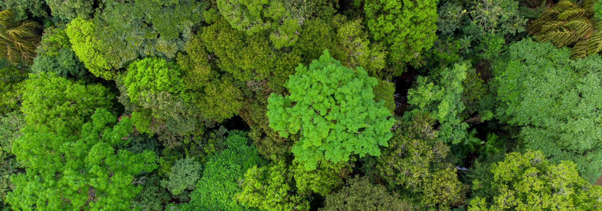
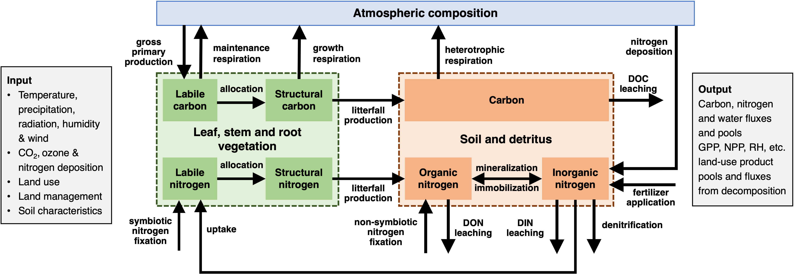

  

# Global Dynamical and Structural Terrestrial Ecosystem Model (GDSTEM)

## Overview

The Global Dynamical and Structural Terrestrial Ecosystem Model (GDSTEM) is a process-based ecosystem model that describes carbon, nitrogen, and water dynamics of plants and soils for terrestrial ecosystems of the globe. GDSTEM uses spatially referenced information on climate, elevation, soils, and vegetation, as well as soil- and vegetation-specific parameters, to estimate important carbon, nitrogen, and water fluxes and pool sizes of terrestrial ecosystems. GDSTEM normally operates on a monthly time step and at a 0.5° latitude/longitude spatial resolution, but the model has also been applied at finer temporal resolutions (daily) and at finer spatial resolutions (down to 1 hectare).

---

## Relationship to TEM

GDSTEM is one of the many versions of the Terrestrial Ecosystem Model (TEM).

Improvements in computer resources and the interests of an increasing number of researchers have allowed TEM to evolve over time to better examine the influence of ecosystem processes and human activities on terrestrial biogeochemistry and how changes in this biogeochemistry may feedback to influence atmospheric chemistry, climate, water quantity and quality, and social welfare.specifically one that is calibrated to run globally, that represents the dynamical influence of land-use change, and that represent the vegetation structure broken into leaves, stem, and roots. As a result, several versions of TEM have been developed over time by different subgroups of modelers. Some versions of TEM has been incorporated into larger modelling frameworks (e.g., MIT Integrated Global System Model [IGSM], CCNY Northeast Regional Earth System Model [NE-REaSM]). Furthermore, the various TEM subgroups have developed input data sets, collaborated with other groups in the development of other ecosystem models, and participated in model intercomparisons to examine how differences in model assumptions may influence simulated ecosystem responses to natural and human disturbances.

GDSTEM represents a version of TEM that is designed to be run globally, although it can also be run regionally, to represent the dynamical influence and response of terrestrial ecosystems to land-use change, and that represents vegetation structure in terms of leaves, stems, and roots.

---

## Purpose of This Website

The purpose of this website is to provide a “roadmap” of the various features of GDSTEM, the team of developers, the past, current, and future activities focusing on model development and use, and the products using the model.

---

## Model Schematic

*Figure 1. Conceptual schematic of the GDSTEM model showing major components and fluxes.*
