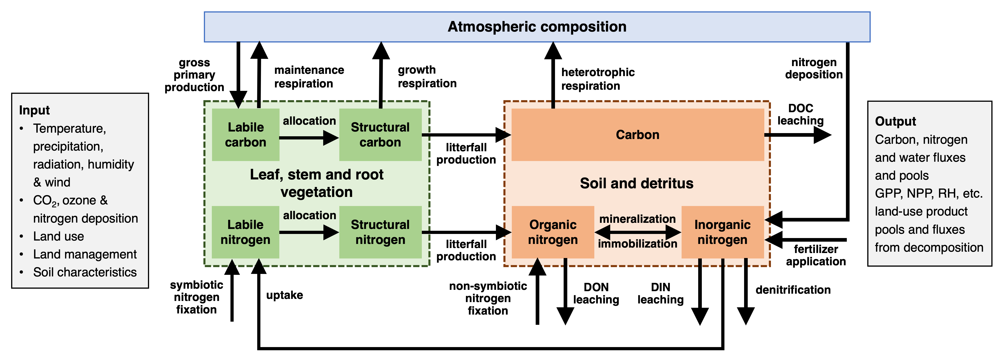

## Overview

The **Global Dynamical and Structural Terrestrial Ecosystem Model (GDSTEM)** is a process-based terrestrial ecosystem model designed to investigate how environmental change and human activities influence the structure and biogeochemistry of terrestrial ecosystems.

GDSTEM couples the dynamics of **carbon, nitrogen, and water** with an explicit representation of **vegetation structure and land-use history**. A cohort-based framework allows the model to represent ecosystems with different disturbance and land-use histories within the same landscape and to track their evolution through time.

GDSTEM is designed for applications ranging from regional ecosystem studies to global simulations of terrestrial ecosystem dynamics. The model normally operates at a monthly time step and a 0.5° latitude/longitude spatial resolution, but it has also been applied at finer temporal and spatial scales.

*Figure 1. Conceptual overview of GDSTEM and its major ecosystem components and processes.*

---

## What distinguishes GDSTEM?

### Ecosystem structure and history

GDSTEM represents vegetation using **cohorts** that retain information about ecosystem age and land-use history. This allows the model to represent ecological legacies that can persist long after a disturbance or land-use transition has occurred.

### Coupled carbon, nitrogen, and water dynamics

The model represents interactions among vegetation productivity, carbon allocation, soil carbon and nitrogen cycling, nutrient availability, and ecosystem hydrology. These coupled processes determine how terrestrial ecosystems respond to changes in environmental conditions.

### Land-use and land-management dynamics

GDSTEM explicitly represents transitions among natural vegetation, croplands, managed grasslands, and urban land. Managed land types distinguish annual and perennial crops, pasture, and rangeland, allowing differences in vegetation characteristics and land management to influence ecosystem dynamics.

### Global-change applications

GDSTEM is being developed to investigate terrestrial ecosystem responses to interacting environmental drivers, including **climate variability and change, atmospheric CO₂, nitrogen deposition, tropospheric ozone, and land-use change**. GDSTEM simulations also contribute to international assessments of the terrestrial carbon cycle, including the **Global Carbon Budget**.

---

## Active development

GDSTEM is under active **development, calibration, and evaluation**. Current work focuses on improving model performance, expanding the representation of ecosystem disturbance, and developing systematic approaches for model calibration and benchmarking.

A comprehensive **model description and evaluation manuscript is currently in preparation**. Additional scientific results and model documentation will be added to this website as that work progresses.

Learn more about the [Model](model.html), meet the [Development Team](team.html), or explore [Publications](publications.html) associated with GDSTEM and its scientific lineage.
