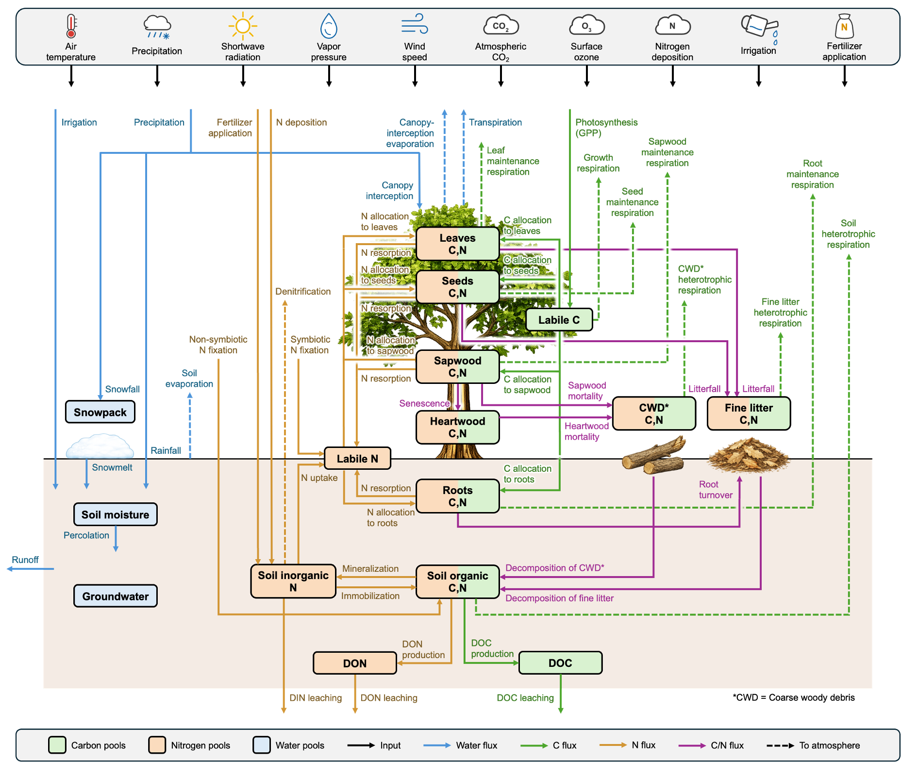
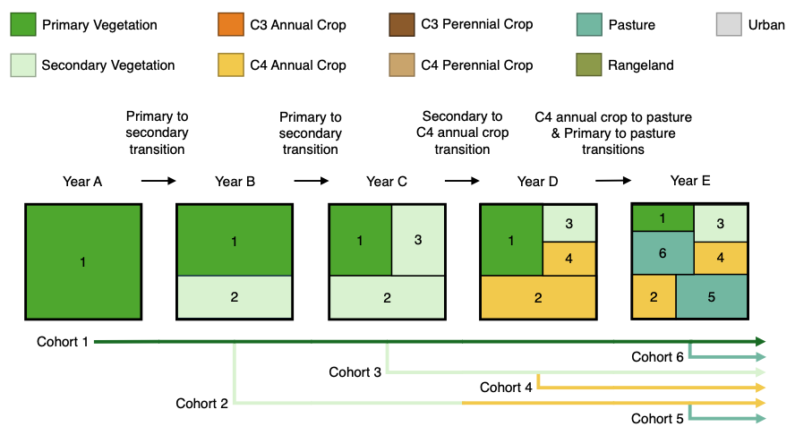

# Model Description and Structure

---

## Overview

**GDSTEM, the Global Dynamical and Structural Terrestrial Ecosystem Model** is a process-based model designed to simulate terrestrial ecosystem dynamics at the global scale.

It combines:
- biogeochemical cycling
- vegetation structural dynamics
- land-use transitions
- land management

---

## Model Structure

*Figure 1. Detailed schematic of the GDSTEM model showing the various pools, fluxes, processes, and inputs.*

GDSTEM simulates carbon and nitrogen storage and fluxes across:
- Leaves
- Stem (sapwood and heartwood)
- Roots
- Soil (organic carbon and nitrogen and inorganic nitrogen)

---

## Land-Use Dynamics

Land-use change (LUC) is a central feature of GDSTEM, which tracks land use history using a cohort approach.

*Figure 2. Example of how GDSTEM tracks historical land-use change through its cohort approach.*

The model tracks transitions between:
- Primary vegetation
- Secondary vegetation
- C3 annual crop
- C4 annual crop
- C3 perennial crop
- C4 perennial crop
- Pasture
- Rangeland
- Urban

These transitions modify the vegetation structure, trigger disturbance processes, and influence water, carbon, nitrogen, and energy fluxes.

---

## Model Code

GDSTEM is under active development. The current development version includes substantial advances beyond the version used for the Global Carbon Budget 2025 simulations. A public release of the current GDSTEM source code will be made available as model development and evaluation progress.

---

## Documentation (coming soon)

We are currently working on a description and evaluation manuscript. 
