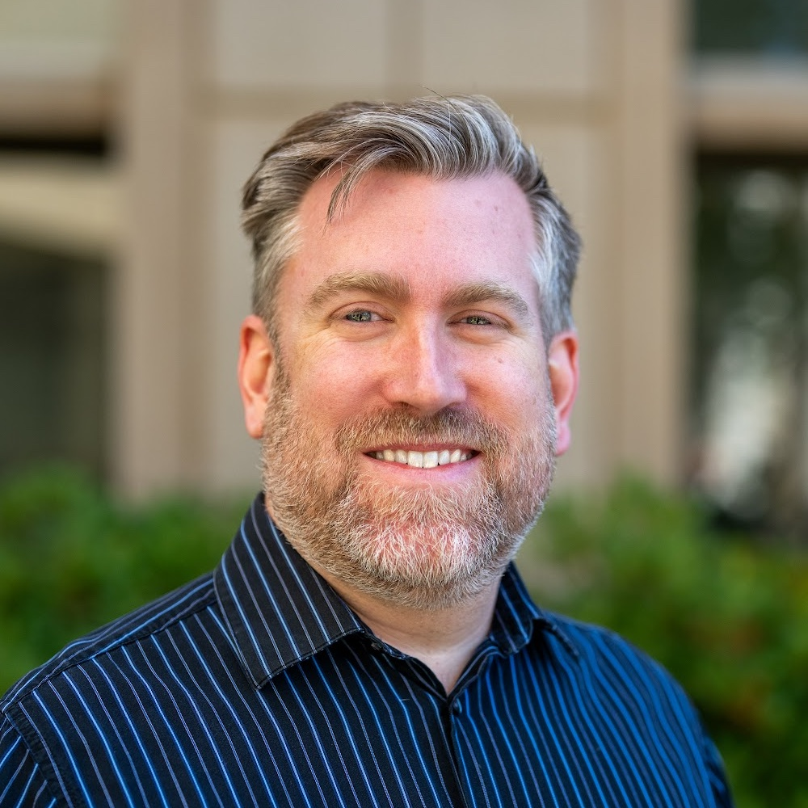

# GDSTEM Development Team

## Principal Investigator

### Erwan Monier

Professor, University of California, Davis  
Global Environmental Change Lab

Research interests:
- Climate change impacts
- Earth system modeling
- Carbon cycle dynamics

---

## Core Developers

### [Name]

Short bio here.

---

### [Name]

Short bio here.

---

## Collaborators

- Collaborator 1 — Institution
- Collaborator 2 — Institution

---

## Students

- Graduate Student 1
- Graduate Student 2

---

## Join Us

We are always interested in collaborations and student involvement.

Contact: emonier@ucdavis.edu
